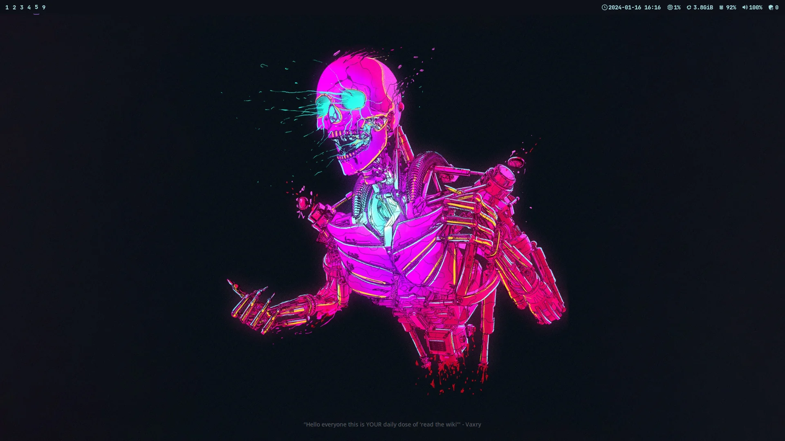

# Dotfiles

> It ain't much but it's mine. 

My dotfiles are managed with [dotbot](https://github.com/anishathalye/dotbot)

# Main Programs List

- [Dunst](https://github.com/dunst-project/dunst).
- [Hyprland](https://hyprland.org/).
- [Mpv](https://mpv.io/)
- [Neovim](https://neovim.io/).
- [Pywal](https://github.com/dylanaraps/pywal).
- [Starship prompt](https://starship.rs/).
- [Thunderbird](https://www.thunderbird.net/en-US/).
- [Tofi](https://github.com/philj56/tofi).
- [Waybar](https://github.com/Alexays/Waybar).
- [Wezterm](https://wezfurlong.org/wezterm/).
- [Zathura](https://pwmt.org/projects/zathura/).
- [Zsh](https://www.zsh.org/).
